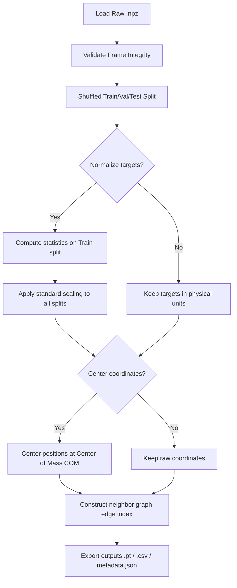

# Molecular Data Preprocessing Pipeline Documentation

This document describes the design, features, and usage of the molecular data preprocessing pipeline.

---

## 1. Supported Input Formats

The preprocessing pipeline expects a raw molecular trajectory stored in the **NumPy compressed archive (`.npz`)** format. The file must contain:
- **`z`**: Nuclear charges / atomic numbers of shape `(N_atoms,)` (integer array).
- **`R`**: Coordinates of shape `(N_frames, N_atoms, 3)` (float array).
- **`E`**: Total potential energies of shape `(N_frames,)` or `(N_frames, 1)` (float array).
- **`F`**: Atomic forces of shape `(N_frames, N_atoms, 3)` (float array).

---

## 2. Preprocessing Workflow

The pipeline runs through the following sequence:


---

## 3. Execution Examples

All commands should be run from the repository root:

### A. Standard Graph Preparation for NequIP (Recommended)
Keep targets in physical units to allow NequIP's internal stats manager to normalize, but center the coordinates:
```powershell
python scripts/preprocess.py `
  --input_path data/raw/mock_md17.npz `
  --output_dir data/processed `
  --format pt `
  --cutoff 4.0 `
  --center
```

### B. Normalized Graph & CSV Preparation for Custom Baselines
Pre-normalize energies and forces (for standard MLPs, kernel regression, or generic PyG GNN models):
```powershell
python scripts/preprocess.py `
  --input_path data/raw/mock_md17.npz `
  --output_dir data/processed `
  --format both `
  --csv_style both `
  --cutoff 4.5 `
  --normalize `
  --force_scale_type energy_scale `
  --center `
  --seed 42
```

---

## 4. Output Formats

### PyTorch Graphs (`.pt` files)
Contains serialized PyTorch dictionaries or PyG `Data` objects with:
- `pos`: `[N_atoms, 3]` Cartesian coordinates.
- `z` and `atomic_numbers`: `[N_atoms]` nuclear charges.
- `y` and `total_energy`: `[1]` scalar target energy.
- `forces`: `[N_atoms, 3]` force vectors.
- `edge_index`: `[2, N_edges]` connectivity list.
- `pbc`: `[3]` periodic boundary condition flags (defaults to `[False, False, False]`).
- `cell`: `[3, 3]` unit cell lattice parameters (defaults to zeros).

### Tabular CSVs (`.csv` files)
- **`*_long.csv`**: Long format, one row per atom. Columns: `frame_idx`, `atom_idx`, `z`, `pos_x`, `pos_y`, `pos_z`, `force_x`, `force_y`, `force_z`, `energy`.
- **`*_wide.csv`**: Wide format, one row per frame. Columns: `frame_idx`, `energy`, and flat coordinates/forces.

---

## 5. Compatibility Notes

- **NequIP Key-Mapping**: We export both `atomic_numbers`/`total_energy` (expected by NequIP) and `z`/`y` (expected by standard PyG / custom code) to ensure seamless backward compatibility.
- **Double Normalization Warning**: When using NequIP, do **not** pass `--normalize` to the preprocessing script. NequIP's built-in `DataStatisticsManager` handles scaling during train startup.
- **Analytical Force Consistency**: Ensure that `--force_scale_type` is set to `energy_scale` if `--normalize` is active. If set to `force_std`, it will break the derivative relation $\mathbf{F} = -\nabla E$ required by equivariant models.

---

## 6. Current Limitations
- **Memory Scaling**: The script loads the entire dataset into RAM. For large datasets ($> 500,000$ frames), this may lead to high memory usage.
- **Single Cutoff Distance**: The radial graph is constructed using a fixed cutoff distance $R_c$. It does not support multi-shell or species-dependent cutoff distances natively.
