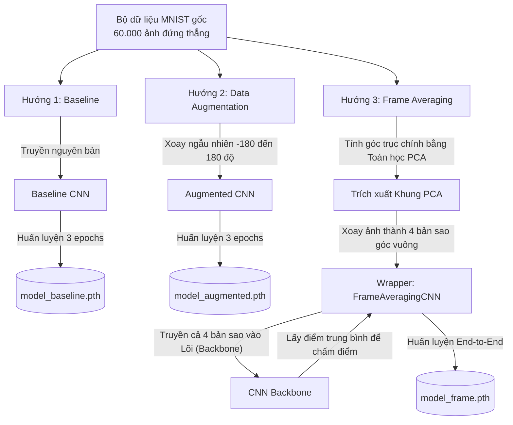
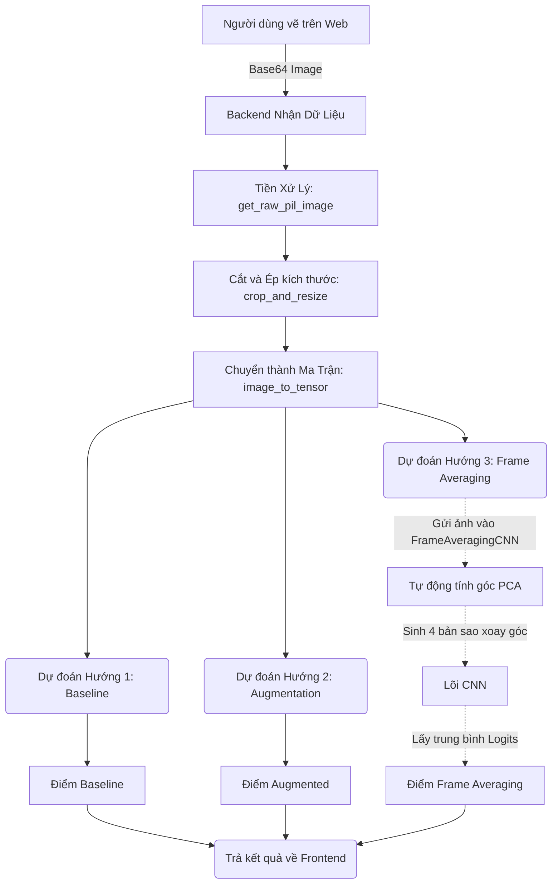

# 📖 BÍ KÍP TOÀN TẬP: ĐỒ ÁN GEOMETRIC DEEP LEARNING - FRAME AVERAGING

Tài liệu này được biên soạn với mục đích **mổ xẻ chi tiết đến từng dòng code** của toàn bộ vòng đời dự án "Nhận diện Hình ảnh Bất biến với Phép xoay (Rotation Invariance) sử dụng Frame Averaging".

Tài liệu sẽ dẫn dắt bạn đi qua 2 giai đoạn cốt lõi:
1. **Giai đoạn Huấn luyện (Training):** Phân tích chi tiết file `train_models.ipynb` để hiểu máy tính đã học như thế nào đối với cả 3 mô hình (Baseline, Data Augmentation, và Frame Averaging).
2. **Giai đoạn Suy luận (Inference):** Phân tích chi tiết file `model_service.py` để hiểu luồng dữ liệu từ lúc người dùng vẽ trên trình duyệt cho đến khi Backend nhào nặn dữ liệu và xuất ra kết quả cuối cùng.

---

## PHẦN 1: NHỮNG KHÁI NIỆM NỀN TẢNG CỦA TRÍ TUỆ NHÂN TẠO

### 1.1 Machine Learning (Học máy) là gì?
Hãy tưởng tượng bạn đang dạy một đứa trẻ cách phân biệt con chó và con mèo. 
- **Lập trình truyền thống:** Bạn sẽ viết ra một bộ quy tắc cứng nhắc: "Nếu có 4 chân, có ria mép, đuôi dài, kêu meo meo -> là con mèo". Nhưng nếu bạn gặp một con mèo bị cụt đuôi thì sao? Quy tắc sẽ bị gãy!
- **Học máy (Machine Learning):** Bạn không viết quy tắc nào cả. Thay vào đó, bạn đưa cho đứa trẻ xem 10.000 bức ảnh con chó và 10.000 bức ảnh con mèo, kèm theo đáp án (nhãn - label) cho từng bức. Bộ não của đứa trẻ sẽ **tự động rút ra quy luật** để phân biệt. Đưa bức ảnh thứ 20.001 vào, nó sẽ đoán được.

Đó chính là cách AI hoạt động. Quá trình ta đưa ảnh cho AI xem đi xem lại gọi là **Quá trình Huấn luyện (Training)**. Quá trình đưa ảnh mới để AI đoán gọi là **Suy luận (Inference / Prediction)**.

### 1.2 Mạng Neural (Neural Network) và Deep Learning
Để AI có thể tự rút ra quy luật, các nhà khoa học mô phỏng lại bộ não người. 
Bộ não chúng ta có hàng tỷ tế bào thần kinh (Neuron) nối với nhau. Khi bạn nhìn thấy quả táo, tín hiệu ánh sáng đi qua mắt, kích thích lớp Neuron đầu tiên, rồi truyền sang lớp thứ 2, lớp thứ 3... Cuối cùng một Neuron ở lớp cuối cùng sáng lên báo hiệu: "Đây là quả táo!".

Trong máy tính, người ta tạo ra **Mạng Neural Nhân tạo (Artificial Neural Network - ANN)**. Mạng này có nhiều lớp (layers):
- **Input Layer:** Nhận dữ liệu đầu vào (ví dụ: các pixel của một bức ảnh).
- **Hidden Layers (Các lớp ẩn):** Càng nhiều lớp ẩn thì mạng càng "sâu" (Deep). Đó là nguồn gốc của từ **Deep Learning (Học sâu)**. Nơi đây chứa các phép toán nhào nặn dữ liệu để trích xuất đặc trưng.
- **Output Layer:** Lớp cuối cùng đưa ra kết quả. Trong đồ án này, lớp Output có đúng 10 Neuron đại diện cho 10 chữ số từ 0 đến 9. Neuron nào có giá trị cao nhất thì AI đoán đó là chữ số tương ứng.

### 1.3 Tại sao lại là CNN (Convolutional Neural Network)?
Nếu ta ném nguyên một bức ảnh 28x28 pixel (784 điểm ảnh) vào mạng Neural thông thường, AI sẽ coi nó như một danh sách 784 con số xếp hàng dọc. Cách này phá hủy hoàn toàn cấu trúc "trên/dưới/trái/phải" của hình ảnh.

Do đó, người ta phát minh ra **CNN (Mạng Neural Tích chập)** - vị vua của xử lý ảnh.
Thay vì nhìn toàn bộ bức ảnh cùng lúc, CNN dùng một cái "kính lúp" (gọi là Kernel hoặc Filter) có kích thước nhỏ (ví dụ 3x3 pixel) để **trượt dọc và trượt ngang** trên toàn bộ bức ảnh. Quá trình trượt này gọi là **Tích chập (Convolution)**.
- Kính lúp thứ 1 chuyên tìm các "đường chéo".
- Kính lúp thứ 2 chuyên tìm "đường cong".
- Kính lúp thứ 3 chuyên tìm "cạnh ngang".

Sau khi đi qua nhiều lớp kính lúp, máy tính sẽ hiểu: "À, bức ảnh này có một vòng tròn ở trên và một cái đuôi ở dưới, vậy chắc chắn là số 9!".

---

## PHẦN 2: BÀI TOÁN CỦA CHÚNG TA VÀ VẤN ĐỀ "MÙ HƯỚNG"

### 2.1 Bộ dữ liệu MNIST và Căn bệnh "Học vẹt"
Bộ dữ liệu ta dùng để dạy AI là **MNIST** - tập hợp 60.000 chữ số viết tay. Đặc điểm của bộ dữ liệu này là **toàn bộ các chữ số đều đứng thẳng**. 
Khi ta dùng MNIST để huấn luyện một mạng CNN (đặt tên là **Baseline Model**), AI học cực nhanh và đoán cực chuẩn (độ chính xác > 99%).

Tuy nhiên, đời không như là mơ! Vì AI chỉ toàn thấy chữ số đứng thẳng, nên khi bạn vẽ một chữ số 9 và **xoay nó nằm ngang**, Baseline Model sẽ đứng hình. Nó nhìn cái số 9 nằm ngang và thấy giống... chữ "a", hoặc chẳng giống cái gì cả. Kết quả là nó đoán sai bét nhè.
Đây gọi là tính chất **Không có khả năng Bất biến với Phép xoay (Lack of Rotation Invariance)**.

### 2.2 Các khái niệm Hình học trong Machine Learning (Geometric ML)
Đây là lúc đồ án của bạn tỏa sáng. Trong lĩnh vực Geometric Deep Learning, người ta quan tâm đến sự tác động của nhóm các phép biến đổi (Group of Transformations).
- **Phép xoay trong 2D** được gọi tắt là nhóm **SO(2)** (Special Orthogonal Group in 2 dimensions). Nó bao gồm mọi góc xoay từ $0^\circ$ đến $360^\circ$ liên tục.
- **Bất biến (Invariance):** Bạn muốn AI đưa ra CÙNG MỘT KẾT QUẢ bất kể đầu vào bị thay đổi thế nào. $f(\text{Xoay}(\text{Ảnh})) = f(\text{Ảnh})$. Ví dụ: Ảnh chó xoay ngược xoay xuôi thì vẫn phải đoán là con chó.
- **Đồng biến (Equivariance):** Khi đầu vào thay đổi, đầu ra cũng phải thay đổi tương ứng y hệt. $f(\text{Xoay}(\text{Ảnh})) = \text{Xoay}(f(\text{Ảnh}))$. Trong đồ án này, ta nhắm tới Invariance (Bất biến) để kết quả cuối cùng (con số 0-9) không đổi.

---

## PHẦN 3: BA HƯỚNG GIẢI QUYẾT TRONG ĐỒ ÁN VÀ FLOW HUẤN LUYỆN

Mục tiêu của file Notebook (`train_models.ipynb`) là giải quyết "căn bệnh mù hướng" bằng 3 con đường khác nhau.



### 3.1 Hướng 1: Mô hình cơ sở (Baseline Model)
Chỉ dùng mô hình CNN huấn luyện trên ảnh thẳng đứng gốc. Khi ảnh thẳng, nó cực mạnh. Khi ảnh xoay dù chỉ một chút, độ tự tin (Confidence) tụt thê thảm và đoán sai hoàn toàn.

### 3.2 Hướng 2: Tăng cường dữ liệu (Data Augmentation)
Trước khi cho AI xem ảnh, code sẽ tự động xoay ngẫu nhiên bức ảnh đó tứ tung (từ -180 đến 180 độ). AI nhận ra được các ảnh nghiêng ngả, nhưng tốn dung lượng não và gây **Lú lẫn (Ambiguity)** (ví dụ số 9 lộn ngược và số 6).

### 3.3 Hướng 3: Trung bình Khung (Frame Averaging) Huấn luyện End-to-End
Đây là đỉnh cao Toán học. Áp dụng PCA để trích xuất Khung 4 góc `[-PCA, -PCA+90, -PCA+180, -PCA+270]`. Khi mạng được học trên dữ liệu của 4 khung này và lấy điểm số trung bình cộng, AI sẽ "miễn nhiễm" hoàn toàn với phép xoay mà không bao giờ bị ảo giác.

---

## PHẦN 4: GIAI ĐOẠN HUẤN LUYỆN (TRAINING) - JUPYTER NOTEBOOK

Bây giờ ta đi thẳng vào các đoạn code trích xuất từ `train_models.ipynb` để mổ xẻ cấu trúc thuật toán.

### 4.1 Kiến trúc Mạng Neural Cơ sở (SimpleCNN)
Bất kể là hướng tiếp cận nào, trái tim của hệ thống vẫn là một mạng Tích chập (CNN) cơ bản tên là `SimpleCNN`.

```python
class SimpleCNN(nn.Module):
    def __init__(self):
        super(SimpleCNN, self).__init__()
        # Lớp chập 1: Nhận 1 kênh màu (ảnh xám), xuất ra 16 kênh đặc trưng. 
        # Kernel 5x5, padding=2 giúp ảnh giữ nguyên kích thước 28x28.
        self.conv1 = nn.Conv2d(1, 16, kernel_size=5, padding=2) 
        self.relu = nn.ReLU()
        
        # Lớp gộp (Pooling): Thu nhỏ ảnh đi một nửa, từ 28x28 xuống còn 14x14.
        self.maxpool = nn.MaxPool2d(2) 
        
        # Lớp chập 2: Nhận 16 kênh từ bước trước, xuất ra 32 kênh. 
        self.conv2 = nn.Conv2d(16, 32, kernel_size=5, padding=2) 
        
        # Lớp tuyến tính 1 (FC1): Ảnh lúc này là 7x7 với 32 kênh. Dàn phẳng ra thành 1568 nơ-ron.
        self.fc1 = nn.Linear(32 * 7 * 7, 128) 
        
        # Lớp tuyến tính 2 (FC2): Ra 10 nơ-ron đại diện cho 10 chữ số (Logits).
        self.fc2 = nn.Linear(128, 10)

    def forward(self, x):
        # Flow đi thẳng từ ảnh -> chập -> gộp -> làm phẳng -> Logits.
        x = self.maxpool(self.relu(self.conv1(x)))
        x = self.maxpool(self.relu(self.conv2(x)))
        x = x.view(-1, 32 * 7 * 7)
        x = self.relu(self.fc1(x))
        x = self.fc2(x)
        return x
```

### 4.2 Hàm Huấn luyện Chung (Training Loop)
Đây là "bếp lò" nhận vào mô hình rỗng, đưa dữ liệu vào liên tục để mô hình tự học.

```python
def train_model(model, trainloader, epochs=3):
    model.to(device)
    # Loss Function (CrossEntropyLoss): Dùng để chấm điểm sai lệch so với đáp án thực.
    criterion = nn.CrossEntropyLoss()
    # Optimizer (Adam): Bộ tối ưu hóa tự động điều chỉnh trọng số nơ-ron để giảm Loss.
    optimizer = optim.Adam(model.parameters(), lr=0.001)
    
    for epoch in range(epochs):
        for i, data in enumerate(trainloader, 0):
            inputs, labels = data[0].to(device), data[1].to(device)
            
            optimizer.zero_grad()            # 1. Reset rác từ vòng trước
            outputs = model(inputs)          # 2. Suy đoán thử (Forward)
            loss = criterion(outputs, labels) # 3. Tính điểm phạt (Loss)
            loss.backward()                  # 4. Truy tìm nơ-ron sai (Lan truyền ngược)
            optimizer.step()                 # 5. Sửa lỗi
```

### 4.3 Huấn luyện Baseline & Data Augmentation Model
Sự khác biệt của 2 mô hình này chỉ nằm ở phần tiền xử lý dữ liệu:

```python
# Baseline: Chỉ đẩy về Tensor, ảnh gốc giữ nguyên (toàn số thẳng).
transform_baseline = transforms.Compose([
    transforms.ToTensor(),
    transforms.Normalize((0.1307,), (0.3081,))
])

# Augmentation: Thêm lớp RandomRotation(180) để xoay loạn xạ.
transform_augmented = transforms.Compose([
    transforms.RandomRotation(180), 
    transforms.ToTensor(),
    transforms.Normalize((0.1307,), (0.3081,))
])
```

### 4.4 Huấn luyện Frame Averaging Model (Đỉnh cao Toán học)
Đây là đoạn code phức tạp và đắt giá nhất để tạo ra một con AI bách chiến bách thắng với phép xoay.

**Thuật toán tìm góc PCA (Principal Component Analysis):**
Đoạn code này dùng Toán học ma trận để tìm ra "Trục chính" (chiều dài nhất) của nét chữ. 
*Ý nghĩa trừu tượng:* Dù người vẽ nghiêng ngả cỡ nào, PCA sẽ "bắt mạch" được độ nghiêng thực tế của bức ảnh (giống như tìm sống lưng của con vật).

```python
def get_pca_angles_batch(images):
    B = images.shape[0] # Chạy trên cả gói 64 bức ảnh
    angles = torch.zeros(B, device=images.device)
    
    for i in range(B):
        img = images[i, 0]
        # Lọc bỏ nhiễu, chỉ bắt lấy các hạt mực đen
        y_indices, x_indices = torch.where(img > 0.2)
        if len(x_indices) < 2: continue
            
        # Lập ma trận hiệp phương sai (Covariance Matrix) mô tả sự phân tán X, Y
        x_centered = x_indices.float() - torch.mean(x_indices.float())
        y_centered = y_indices.float() - torch.mean(y_indices.float())
        coords = torch.stack([x_centered, y_centered], dim=0)
        cov_matrix = torch.matmul(coords, coords.T) / (len(x_indices) - 1)
        
        # Eigen Decomposition (Phân rã trị riêng) để tìm Vector chính (hướng dài nhất)
        eigenvalues, eigenvectors = torch.linalg.eigh(cov_matrix)
        principal_vector = eigenvectors[:, 1]
        
        # arctan2 để quy đổi Vector đó ra góc quay (Angle)
        angle_rad = torch.atan2(principal_vector[1], principal_vector[0])
        angles[i] = math.degrees(angle_rad.item())
    return angles
```

**Lõi bọc Frame Averaging (Wrapper):**
Đây là nơi ta áp dụng kiến thức "Frame". Một Khung gồm 4 bản sao.

```python
class FrameAveragingCNN(nn.Module):
    def __init__(self, backbone):
        super(FrameAveragingCNN, self).__init__()
        self.backbone = backbone # Nhét SimpleCNN vào trong
        
    def forward(self, x):
        B = x.shape[0]
        angles = get_pca_angles_batch(x) # Tính ra góc xương sống của ảnh
        
        rotated_images = []
        for i in range(B):
            base_angle = -angles[i].item() # Góc ngược lại để bẻ thẳng "sống lưng"
            
            # Tạo KHUNG (Frame) gồm 4 bản sao lệch nhau 90 độ
            for offset in [0, 90, 180, 270]:
                rot_img = TF.rotate(x[i], base_angle + offset)
                rotated_images.append(rot_img)
        
        rotated_batch = torch.stack(rotated_images, dim=0)
        
        # Đưa toàn bộ 4 bản sao này đi qua mạng Neural cơ sở
        logits = self.backbone(rotated_batch)
        
        # QUAN TRỌNG: Lấy trung bình cộng (Averaging) điểm số của 4 tấm ảnh
        logits = logits.view(B, 4, 10)
        avg_logits = torch.mean(logits, dim=1)
        
        return avg_logits
```

---

## PHẦN 5: FLOW SUY LUẬN TẠI BACKEND (INFERENCE) - `model_service.py`

Khi người dùng vẽ xong và bấm "Dự đoán", bức ảnh sẽ trải qua hành trình sau tại máy chủ.



### 5.1 Khâu Tiền xử lý Dữ liệu (Preprocessing)
Ảnh từ trình duyệt là ảnh khổng lồ (280x280), nền trắng nét đen. Nó phải được tẩy rửa sạch sẽ về chuẩn MNIST (28x28, nền đen nét trắng). Mặc dù là code xử lý ảnh lặt vặt, nhưng nếu không có chúng, AI sẽ bị "mù".

```python
def get_raw_pil_image(base64_str: str) -> Image.Image:
    # ... code đọc Base64 ...
    # Chuyển thành ảnh xám. Nếu là nền trắng thì Invert (nghịch đảo) lại thành nền đen.
    if img_gray.getpixel((0, 0)) > 128:
        img_gray = ImageOps.invert(img_gray)
    return img_gray

def crop_and_resize_to_mnist(img_gray: Image.Image) -> Image.Image:
    # 1. Bounding Box: Cắt tỉa sạch sẽ viền đen thừa mứa xung quanh nét mực.
    bbox = img_gray.getbbox()
    # 2. Resize: Thu nhỏ sát nút nét vẽ đó sao cho vừa khít với cạnh 20 pixel.
    # ... (code resize Lanczos) ...
    
    # 3. Center of Mass: Phải tự tính ra Trọng tâm khối lượng của nét vẽ (nét mực đậm ở đâu thì tâm dịch về đó). 
    # Sau đó mới dán cái Trọng tâm này vào đúng tọa độ (14,14) ở giữa bức ảnh 28x28 chuẩn.
    cx = np.average(x_indices, weights=weights) 
    cy = np.average(y_indices, weights=weights)
    img_final.paste(img_resized, (int(14 - cx), int(14 - cy)))
    
    return img_final
```

### 5.2 Hàm chạy Dự đoán chính (Inference)
Tấm ảnh 28x28 hoàn hảo được chuyển thành Tensor và đẩy qua cả 3 bộ Não.

```python
def predict_single_tensor(model: nn.Module, tensor: torch.Tensor):
    with torch.no_grad():
        output = model(tensor) # Đẩy qua Neural Network lấy Logits
        probs = F.softmax(output, dim=1) # Ép Logits thành phần trăm (%)
        conf, pred = torch.max(probs, 1) # Bắt lấy kết quả cao nhất
        return pred.item(), conf.item(), probs

# Trong hàm generate_prediction:
# Hướng 1 và Hướng 2 gọi thẳng mô hình trơn (Thường tự tin thấp hoặc đoán sai nếu ảnh bị lộn ngược)
base_pred, base_conf, _ = predict_single_tensor(baseline_model, input_tensor)
aug_pred, aug_conf, _ = predict_single_tensor(augmented_model, input_tensor)

# Hướng 3: Gọi Frame Averaging Model.
# Nhờ đã huấn luyện End-to-End, mạng frame_model tự biết cách lôi thuật toán PCA ra nắn thẳng 4 khung hình,
# tự đẩy qua mạng nơ-ron, tự cộng trung bình và nhả kết quả bách phát bách trúng.
avg_pred, avg_conf, avg_probs = predict_single_tensor(frame_model, input_tensor)
```

## PHẦN 6: KẾT LUẬN

Sự vĩ đại của đồ án này nằm ở tư duy giải quyết vấn đề bằng Toán học.

- Nếu bạn dùng **Data Augmentation**, bạn đang dạy AI kiểu nhồi nhét, "thấy cái gì lạ thì học thuộc lòng cái nấy". Kết quả là khi gặp dữ liệu đặc biệt (số 6 xoay và số 9 xoay), mô hình sẽ xung đột và lú lẫn.
- Khi bạn dùng **Frame Averaging (Huấn luyện End-to-End)**, bạn đang trao cho mô hình một lăng kính Toán học (Khung - Frame). Bạn dạy nó rằng: "Dù vạn vật xoay vần thế nào, chỉ cần đưa nó về những điểm bám (PCA Principal Axis), cộng dồn mọi góc độ lại, chân lý sẽ hiện ra". 
Hệ quả là mô hình của bạn đạt được **Bất biến Tuyệt đối (Exact Invariance)** - Mọi phép xoay đều dẫn đến cùng một kết quả cuối cùng mà không bao giờ bị phụ thuộc vào dung lượng mạng Neural hay bị ảo giác bởi dữ liệu rác. 

Chúc bạn có một bài thuyết trình đồ án xuất sắc và chinh phục mọi hội đồng khoa học! 🎉
